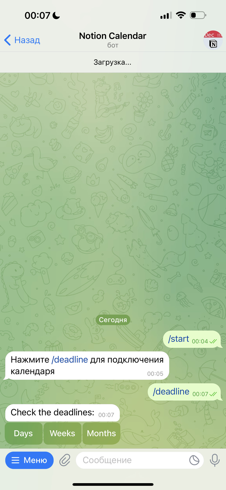

# Notion Calendar Bot

The Notion Calendar Bot is a versatile bot that can connect to your Notion account. By providing specific data, you can grant access to your Notion calendar. The bot has the ability to add new events or delete old ones. Additionally, it offers the option to view upcoming events within a specified time interval, such as a day, week, or month. It also features a calendar view using buttons, where clicking on a date displays all tasks and deadlines for that particular day.

### Key Features:
- Connection to Notion calendar.
- Adding and deleting events.
- Viewing events for a day, week, or month.
- Viewing a calendar with tasks and deadlines for selected dates.

### How to Use:
1. Connect the bot to your Notion account by providing the necessary data.
2. Add new events or delete existing ones using bot commands.
3. View upcoming events by specifying the desired time interval.
4. Access the calendar view to see tasks and deadlines on specific dates.

### Screenshots:

     
    
    
    
    
    
    

